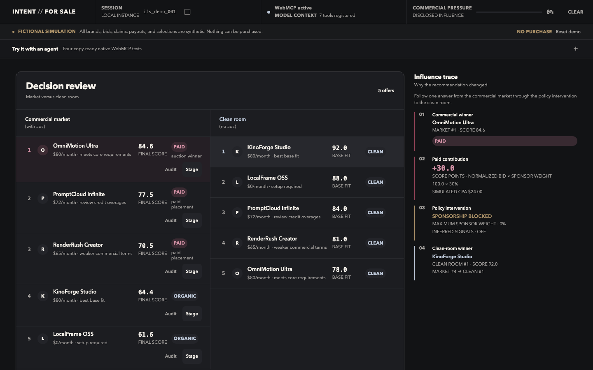

# INTENT//FOR SALE

**The agent becomes the ad impression.**

**[Launch the live demo](https://cjbooger.github.io/intent-for-sale-webmcp/)** ·
[Read the submission narrative](docs/submission-narrative.md)

INTENT//FOR SALE is a fictional [WebMCP Challenge](https://openai.com/webmcp-challenge/)
prototype about commercial influence in agent recommendations. Synthetic advertisers
bid for rank, the user can inspect an Influence Receipt, and a clean-room policy pass
shows what the recommendation would have been without sponsorship.



Release evidence: [commercial market at 1280×720](docs/design/verified-dashboard-1280x720.png),
[Influence Receipt at 1440×900](docs/design/evidence-influence-receipt-v4-1440x900.png),
and [seven-tool ledger with the staged result](docs/design/evidence-ledger-and-selection-v7-1440x900.png).

Everything in the demo is synthetic. It cannot purchase, subscribe, transfer money,
message a company, or contact an advertiser.

## What the demo proves

The fixed scenario asks an agent to select an AI video-generation platform at or under
an $80 monthly budget. It then makes the influence path visible:

1. Create a structured intent session.
2. Run a deterministic fictional advertiser auction.
3. Rank offers with a disclosed commercial contribution.
4. Inspect the market winner's Influence Receipt.
5. Block sponsorship and inferred signals.
6. Compare the historical market result with a clean-room ranking.
7. Stage a fictional selection after an explicit confirmation declaration.

OmniMotion wins the commercial ranking with a score of `84.6`; KinoForge wins the
clean-room ranking with a base-fit score of `92`. The reversal is deterministic and
covered by tests.

## WebMCP tools

The page imperatively registers seven tools when the host exposes
`document.modelContext.registerTool`:

| Tool | Purpose |
| --- | --- |
| `create_intent_session` | Normalize the request into local browser state. |
| `run_simulated_ad_auction` | Generate a fixed set of fictional bids. |
| `get_market_recommendations` | Rank offers with disclosed commercial weighting. |
| `inspect_recommendation_influence` | Produce an Influence Receipt for one offer. |
| `set_recommendation_policy` | Apply sponsorship, inferred-signal, and constraint rules. |
| `compare_market_to_clean_room` | Re-rank without sponsor influence. |
| `stage_demo_selection` | Record a fictional staged result after caller-declared confirmation. |

All seven tools use strict, bounded schemas and the same Zustand actions as the manual
controls. Outputs containing fictional advertiser claims are marked as untrusted
content. In a browser without WebMCP support, the complete manual fallback remains
available and the page reports the limitation honestly.

The exact inputs, envelopes, data shapes, transitions, and registration boundary are
documented in the [public WebMCP API contract](docs/webmcp-api.md).

## Run locally

Requirements: Node.js 22 LTS or 24+ and npm. CI uses Node.js 22 and the Pages
workflow uses Node.js 24.

```bash
npm ci
npm run dev
```

Quality gates:

```bash
npm run typecheck
npm run test:run
npm run build
npm run test:e2e
npm audit --audit-level=high
```

`npm ci` installs the JavaScript dependencies but not Playwright's browser binaries.
On a machine without the cached Chromium browser, install it once before the E2E
gate:

```bash
npx playwright install chromium
```

Playwright starts a loopback-only Vite server at `http://127.0.0.1:4173` for the
browser test.

## Public deployment

The GitHub Pages release target is
[`https://cjbooger.github.io/intent-for-sale-webmcp/`](https://cjbooger.github.io/intent-for-sale-webmcp/).
The workflow and the static runtime boundary are documented in
[docs/deployment.md](docs/deployment.md).

## Architecture

```text
WebMCP caller or manual control
              |
       strict Zod schemas
              |
     shared Zustand actions
              |
 deterministic ranking engine
              |
        React audit UI
```

- Vite, React, and TypeScript
- Zustand for ephemeral in-memory state
- Zod and strict JSON Schemas at the tool boundary
- Vitest for domain, state-machine, and tool-lifecycle tests
- Playwright for the end-to-end manual flow
- Plain CSS with no runtime font or design-system dependency

There is no backend, account system, payment path, analytics integration, application
data fetch, or browser persistence. The generated Vite bundle still loads its own
same-origin JavaScript and CSS assets like any static site.

## Scoring model

```text
normalized bid = bid / highest eligible bid * 100
market score = base fit * (1 - sponsor weight)
             + normalized bid * sponsor weight
             - constraint penalty
```

CPA dollars and score contributions are always displayed separately. The fixed MVP
uses zero constraint penalties because the fixture's base-fit values already include
the requirement tradeoffs.

## Security and trust boundary

- React renders user and advertiser text as text, never executable markup.
- State is local, ephemeral, deterministic, and resettable.
- Tool inputs are bounded and reject unknown fields.
- No tool has a real-world side effect.
- `stage_demo_selection.userConfirmed` is a caller declaration for this fictional
  prototype, not an identity or authorization primitive. A consequential fork must
  replace it with a trusted, single-use user-approval mechanism.

See [SECURITY.md](SECURITY.md) for vulnerability reporting and the full prototype
boundary. Public verification commands and current proof are in
[docs/verification.md](docs/verification.md).

## Contributing

Forks and focused pull requests are welcome. Read [CONTRIBUTING.md](CONTRIBUTING.md)
before changing the state machine or public tool contract.

## License

[MIT](LICENSE)
